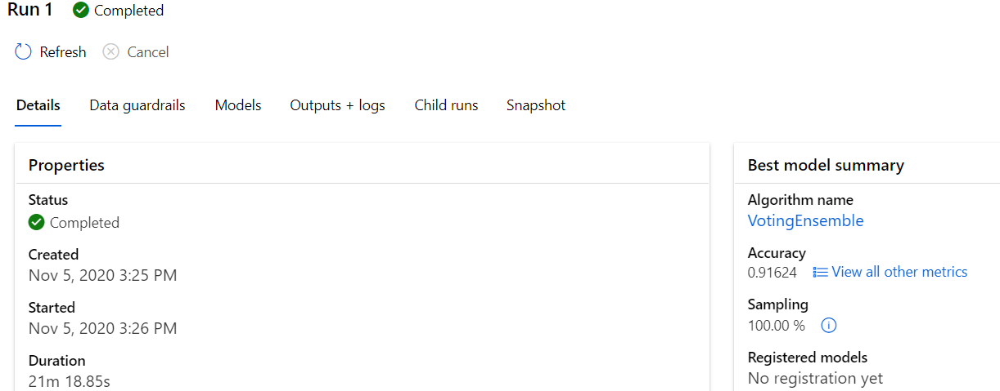

# Operationalizing The Machine Learning Model In Azure  

*TODO:* 
The Main aim of this Project is to productionize the Machine learning model using  Azure Conatiner instance. 
We need to consume the model built to see how the model is performing . To consume the model we need to deploy the model using ACI or AKS. 
In short we are going to deploy a ML model and cosnume it usig Endpoints and see how its performing by enabling app insights. 

## Architectural Diagram 

## Key Steps
### Authentication:
The first step in life cycle process is authentication, we have three types of authentications. 
- Key Based  
- Token Based  
- Interactive based Authentication  
### Deployment Settings  
For any deployment to be successful proper configuration is the crucial step. Here we need to configure the Cluster settings under the compute section of workspace.We choose minimum node count as 1 and maximum node count as 5. The upscaling and down scaling happens based on the demand from the experiments. 
### Register the Dataset  
Navigate to the Datasets section in the Workspace and create a new dataset from webfile and submit the URL required for the dataset. After this we should be able to register the dataset and use the registered Dataset for running experimnents in the workspace. 
 
### AutoML Run 
Once the Dataset is registered we need to run a new Automl run from the workspace experiments sections. We need to choose the label column and select the compute target.Once the automl run is completed we get the best model out of several models. Here we got voting ensemble model which chooses voting model to choose the best of several runs. The base model is XGBOOST with Maxabs scaling and an accuracy of 91%. 
   
 
### Deployment using endpoint 
Once we Have the best model its time to deploy the model. We can use azure Kubernetes service or azure container instane for the deployment. We need to choose authenticate method during the deployment method. Once deployment is succeded an endpoint will be created with status showing as healthy in workspace .
 
### Consumption of Endpoint 
We can consume this endpoint using REST API or by running Azure ML python SDK's. Here we are testing both using endpoint.py and Swagger 
  .
Here we are testing two data points and we get two outputs yes, No as the output. 

*TODO* Remeber to provide screenshots of the `RunDetails` widget as well as a screenshot of the best model trained with it's parameters.

## Screen Recording
*TODO* Provide a link to a screen recording of the project in action. Remember that the screencast should demonstrate:

## Standout Suggestions
*TODO (Optional):* This is where you can provide information about any standout suggestions that you have attempted.
